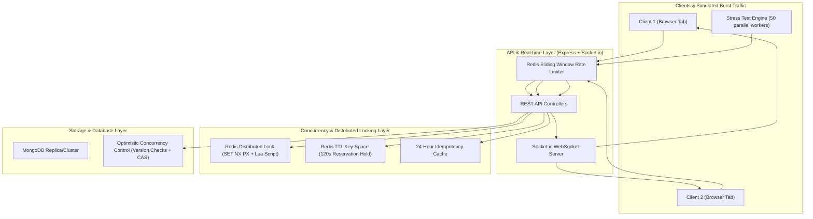
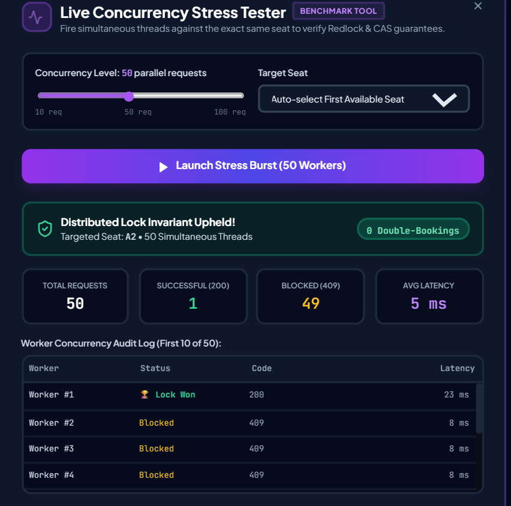

# 🎟️ FlashTicket — High-Concurrency Flash-Sale & Seat Reservation Engine

[](https://flash-ticket-engine.vercel.app)
[](https://flash-ticket-engine.onrender.com)


[](https://nodejs.org/)
[](https://reactjs.org/)
[](https://redis.io/)
[](https://www.mongodb.com/)
[](https://www.docker.com/)
[](LICENSE)

> 🌐 **Live Application:** [https://flash-ticket-engine.vercel.app](https://flash-ticket-engine.vercel.app)  
> 📡 **API Service:** [https://flash-ticket-engine.onrender.com](https://flash-ticket-engine.onrender.com)


> A production-grade distributed seat reservation and ticketing engine built to solve **race conditions, lock contention, and double-booking** during high-demand flash sales (e.g., concert tickets, high-traffic product drops).

---

## 📌 Problem Statement

During high-concurrency ticket drops (e.g., Coldplay or Taylor Swift tours), tens of thousands of users attempt to purchase the exact same limited seats at the exact same millisecond. 

Standard database transactions and naïve CRUD applications fail under these conditions due to **race conditions**, resulting in:
1. **Double-booking**: Multiple users are charged for the same seat.
2. **Database Deadlocks**: Heavy row-level locks exhaust database connection pools.
3. **Cart Abandonment Stock Lock**: Users reserve seats and abandon carts, permanently blocking genuine buyers unless automated TTL auto-reclamation is in place.

---

## 🏗️ System Architecture



---

## ⚡ Key Engineering Highlights & Concurrency Primitives

### 1. Two-Tier Concurrency Control (Zero Double-Booking)
* **Tier 1 — Redis Distributed Locking**:
  When a user attempts to hold a seat, the engine executes an atomic Redis command:
  ```bash
  SET lock:seat:<seatId> <lockToken> NX PX 3000
  ```
  Only the fastest concurrent request acquires the lock; all competing threads are immediately short-circuited with `409 Conflict`.
* **Safe Lua Release Script**:
  To prevent a client whose lock timed out from accidentally deleting another client's newly acquired lock, lock release is executed atomically via Lua:
  ```lua
  if redis.call("get", KEYS[1]) == ARGV[1] then
    return redis.call("del", KEYS[1])
  else
    return 0
  end
  ```
* **Tier 2 — MongoDB Optimistic Concurrency Control (CAS)**:
  Every seat document carries an incrementing `version` field. The atomic update condition:
  ```javascript
  Seat.findOneAndUpdate(
    { _id: seatId, version: seat.version, status: { $ne: 'BOOKED' } },
    { $set: { status: 'HELD', heldBy: userId }, $inc: { version: 1 } },
    { new: true }
  );
  ```
  Guarantees mathematical correctness even if the cache layer encounters a network partition.

### 2. TTL-Based Inventory Reservation Hold & Auto-Reclaim
* Selected seats are held for **120 seconds** to allow checkout completion.
* A background worker scans and auto-reclaims expired reservations every **4 seconds**, reverting seats back to `AVAILABLE` and notifying all connected clients over WebSockets without requiring manual page reloads.

### 3. Idempotent Financial Checkout Pipeline
* All checkout requests enforce the `Idempotency-Key` HTTP header.
* Responses are cached in Redis for 24 hours. Repeating identical requests (e.g. from network retries or rapid double-clicking) replays the cached confirmation without triggering duplicate charges or duplicate database orders.

### 4. Real-time Sub-Millisecond WebSocket Synchronization
* Integrated **Socket.io** pushes seat state transitions (`AVAILABLE` 🟢 $\rightarrow$ `HELD` 🟡 $\rightarrow$ `BOOKED` 🔴) to all connected clients in real time.

---

## 🧪 Built-in Concurrency Stress Testing

The application includes an interactive **Live Concurrency Stress Tester** built directly into both the frontend UI and as a standalone CLI tool.



### Running the CLI Benchmark:
```bash
cd server
npm run stress-test
```

### Sample Benchmark Audit Output:
```text
================================================================
⚡ FLASH-TICKET ENGINE: CONCURRENCY STRESS TEST (CLI)
🎯 Testing Distributed Locking & Race Condition Prevention
================================================================

[1/4] Fetching active flash-sale events from http://localhost:5000/api/events...
✔ Found event: "Coldplay: Music of the Spheres World Tour"
[2/4] Querying seat inventory...
✔ Target Seat Selected: A1 (VIP - $250)
[3/4] Firing 50 simultaneous requests against seat A1...

================================================================
📊 STRESS TEST AUDIT REPORT
================================================================
Total Requests Sent    : 50
Total Elapsed Time     : 84 ms
Successful Holds (200) : 1  (Expected: 1)
Blocked Requests (409) : 49 (Expected: 49)

✅ TEST PASSED: Zero double-booking detected.
🔒 Distributed lock & atomic CAS successfully isolated the winning transaction.
🏆 Winning User: cli-worker-1 (Latency: 12 ms)
================================================================
```

---

## 🚀 Quick Start & Installation

### Option A: Using Docker Compose (Recommended)
Spin up the entire stack (React Client, Express Server, MongoDB, and Redis) with a single command:

```bash
docker compose up --build
```

- **Frontend**: [http://localhost:3000](http://localhost:3000)
- **Backend API**: [http://localhost:5000](http://localhost:5000)

---

### Option B: Local Manual Setup

#### Prerequisites
- Node.js (v18+)
- MongoDB (running locally or cloud URI)
- Redis (running locally or via Docker)

#### 1. Backend Setup
```bash
cd server
npm install
cp .env.example .env

# Seed initial event and tiered stadium seats
npm run seed

# Start server in development mode
npm run dev
```

#### 2. Frontend Setup
```bash
cd client
npm install
npm run dev
```
Open [http://localhost:5173](http://localhost:5173) in your browser.

---

## 📡 API Specification

| Method | Endpoint | Description | Concurrency Primitives |
|---|---|---|---|
| `GET` | `/api/events` | List flash sale events | Read-only |
| `GET` | `/api/events/:id/seats` | Get seat inventory with live TTLs | Real-time Redis TTL enrichment |
| `POST` | `/api/events/:id/seats/:seatId/hold` | Atomically reserve a seat for 120s | Redis Distributed Lock + CAS |
| `POST` | `/api/events/:id/seats/:seatId/book` | Confirm order & complete booking | Idempotency Key + Atomic Transaction |
| `POST` | `/api/events/:id/seats/:seatId/release` | Release held seat voluntarily | Atomic lock release + WebSocket broadcast |
| `POST` | `/api/events/:id/reset` | Reset all seats to AVAILABLE | Bulk inventory reset |
| `POST` | `/api/stress-test` | Execute 50-100 parallel worker burst | Concurrency benchmark & audit log |

---

## 💼 Resume / CV Bullet Points (Ready to Copy-Paste)

* **Full-Stack Concurrency Engineering**:
  > *"Architected a high-concurrency ticket reservation engine using Node.js, React, Redis, and MongoDB, handling flash-sale bursts with zero double-booking."*
* **Distributed Locking & Atomic CAS**:
  > *"Implemented distributed locking via Redis `SET NX PX` and atomic Lua release scripts, backed by MongoDB version-based optimistic concurrency control (CAS) to eliminate race conditions under 50+ concurrent requests."*
* **TTL Inventory Management & Idempotency**:
  > *"Engineered a 120-second TTL temporary reservation pipeline with automatic background reclamation and enforced HTTP `Idempotency-Key` transaction caching to prevent duplicate payments."*
* **Real-time Synchronization**:
  > *"Integrated Socket.io WebSockets to broadcast sub-millisecond seat state transitions across active clients, maintaining real-time stadium grid consistency."*

---

## 📄 License
MIT License. Built for educational portfolio and high-concurrency systems design demonstration.
